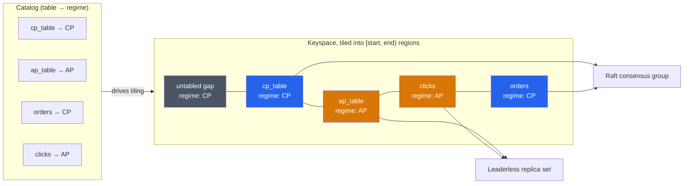
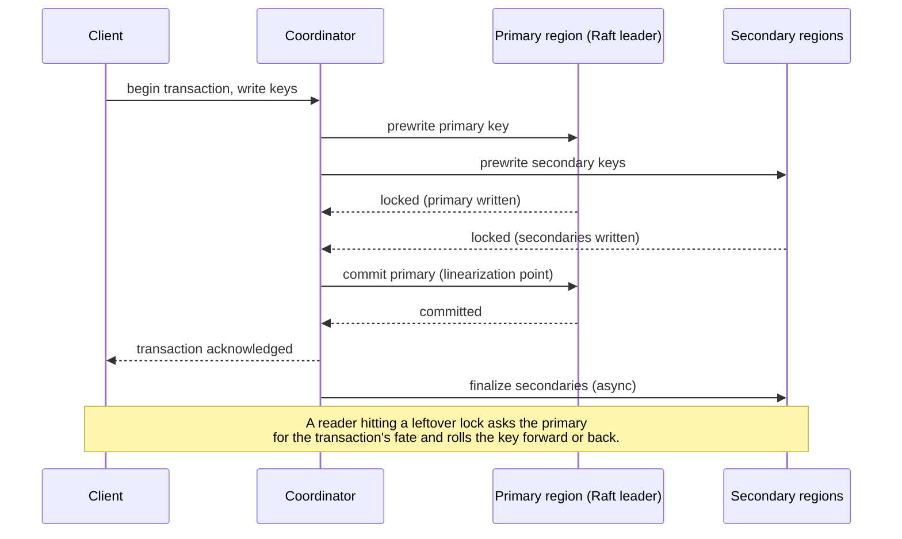
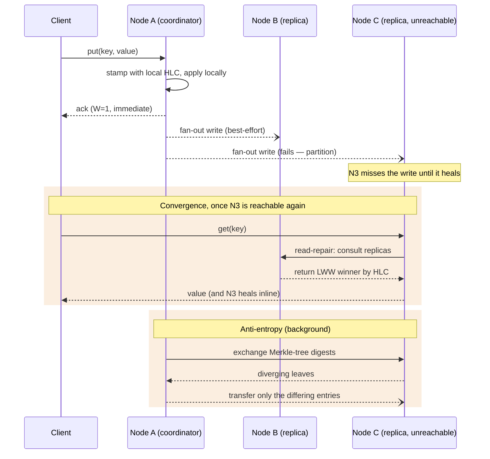
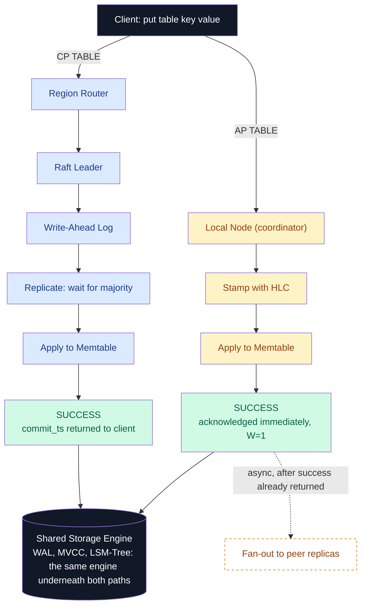
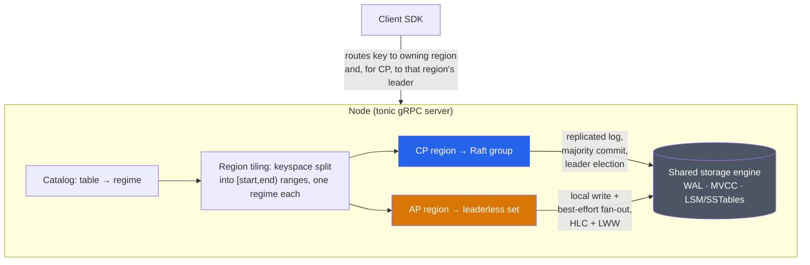

# arcux

> A distributed, transactional key-value database with **per-table tunable consistency**, written from scratch in Rust.

Arcux is built entirely from scratch: the consensus protocol, the storage engine, and the transaction system are hand-rolled — no `raft-rs`, no RocksDB. Building them is the point.

The core idea is **per-table tunable consistency**: instead of forcing an entire cluster to live under one consistency model, each table decides at creation time whether it should be `CP` (strongly consistent) or `AP` (always available, eventually consistent). That choice routes every read and write on the table through a genuinely different code path underneath.

```sql
CREATE TABLE cp_table (...) WITH (consistency = 'CP');   -- Percolator 2PC + Raft + TSO → Snapshot Isolation
CREATE TABLE ap_table (...) WITH (consistency = 'AP');   -- leaderless W=1 + HLC + LWW → always available
```

One storage engine, one cluster, two consistency regimes — chosen by the schema, not toggled per request.

## Why per-table consistency

Not all data needs the same guarantee. Some tables need strict serializable correctness even under contention. Others just need to always accept writes, even if replicas are briefly out of sync. Arcux lets both live in the same cluster, on the same storage engine, distinguished only by how the table was declared — strong consistency where correctness matters, availability where it doesn't, without running two separate systems.

## How it works

### The keyspace is sharded into regions

The keyspace is cut into contiguous **regions** — `[start, end)` ranges split at each table's key-prefix boundary. Each region carries a **regime**, `CP` or `AP`; untabled gaps default to `CP`. This is range-sharding (as in CockroachDB/TiKV), so a table scan stays a contiguous read.

### The catalog decides the regime

The **catalog** (`server/src/catalog.rs`) is the `table name → regime` map, populated by `create_table(name, CP|AP)`. It resolves a key's regime by **longest matching prefix**. Consistency is chosen only here — nothing is negotiated per request.



### CP regions: Raft groups with a leader

Each `CP` region is its own **independent Raft consensus group**, with its own leader, log, and majority — a node hosting several CP regions runs several Raft groups in parallel. A write commits once replicated to a **majority** of the region's voters, giving Snapshot Isolation and zero acknowledged-write loss across a leader failure.

Multi-key transactions use a **Percolator-style two-phase commit**: prewrite every region's slice (primary first), commit the transaction's **primary** key as the single linearization point, then finalize the secondaries. Regions only ever need to agree with the primary, not each other. A coordinator that crashes mid-commit leaves cleanup to the next reader that meets the lock — recovery is a property of the protocol, not a separate subsystem.



A client that hits a non-leader replica gets redirected (`NotLeader`) and retries against the current leader, transparently, via the client SDK's cluster mode.

CP regions are also **self-healing**: when a node dies, PD's failure detector notices and the cluster re-replicates without operator action — a spare node joins as a non-voting **learner** (so the cold replica never stalls writes), catches up, is promoted to voter, and the dead member is dropped. Decommissioning a *live* leader is equally graceful: leadership hands off to a caught-up peer before removal.

### AP regions: leaderless, always available

Each `AP` region has **no leader and no Raft log**. Whichever node a write reaches becomes the coordinator: stamp it with the local **Hybrid Logical Clock**, apply locally, ack the client immediately (W=1), and fan it out best-effort to the other replicas — an unreachable peer doesn't block the write. Conflicts resolve by **Last-Writer-Wins** on the HLC timestamp, so convergence needs no coordination.

Because fan-out is best-effort, a down replica could otherwise miss a key forever. Two mechanisms guarantee replicas **converge** once reachable again:

- **Read-repair** — an AP read consults the replicas, returns the LWW winner, and heals any stale replica inline.
- **Anti-entropy** — a background pass diffs each replica's data via **Merkle tree** digests and transfers only the entries under leaves that differ, so every key converges whether or not it's ever read.



Together they make AP not just available *during* a partition but provably consistent *after* it heals.

### One engine, one cluster

CP and AP regions coexist on the same nodes, writing into the **same underlying storage engine** — the regime only decides how a write gets *ordered and replicated* before it lands, not where it's stored. Adding an `AP` table next to a `CP` table is just another `create_table` call; no second cluster, no separate infrastructure.



## Architecture at a glance



## System guarantees

| Property | CP tables | AP tables |
| --- | --- | --- |
| Consistency | Snapshot Isolation (MVCC + Percolator) | Eventual consistency, Last-Writer-Wins by HLC |
| Availability | Requires a Raft majority to accept writes | Always accepts writes, even mid-partition |
| Durability | Majority-persisted before ack | Locally WAL-persisted before ack |
| Ordering authority | Cluster-wide Timestamp Oracle | Per-node Hybrid Logical Clock |

## What's in each crate

| Crate | Role |
| --- | --- |
| [`engine/`](engine/) (`arcux-engine`) | The storage engine: write-ahead log, MVCC over an LSM tree, crash recovery, and single-node Percolator transactions. |
| [`rpc/`](rpc/) | The gRPC wire contract (`kv`/`raft`/`pd` protobufs) and generated code. |
| [`pd/`](pd/) (`arcux-pd`) | The Placement Driver: cluster timestamp oracle, region registry, per-node membership and failure detection. Runs single-process or as a **replicated 3-node Raft group** (`arcux-pd --cluster 3`), so a PD leader failure never regresses the timestamp oracle. |
| [`raft/`](raft/) (`arcux-raft`) | The hand-rolled Raft consensus core: election, replication, commit safety, persistence, snapshotting, membership changes, non-voting learners, leadership transfer — built transport-free and proven deterministically. |
| [`server/`](server/) (`arcux-server`) | The `tonic` server: binds Raft groups to regions, runs the AP leaderless path, hosts the consistency catalog, and serves the KV/PD RPCs. See the file breakdown below. |
| [`client/`](client/) (`arcux-client`) | The async client SDK: region-aware routing, transparent retry on stale routes or leader changes, and (for a static cluster with no PD) automatic leader-following. |

Inside `server/`:

- `raft_group.rs` — per-region Raft group driver.
- `multiraft.rs` — many region groups multiplexed over one transport, keyed by `group_id`.
- `hlc.rs` / `ap.rs` — the AP write path (HLC timestamps + leaderless fan-out).
- `anti_entropy.rs` — AP convergence: Merkle-digest reconciliation + Last-Writer-Wins merge (background), and read-repair (inline).
- `catalog.rs` — `create_table(name, CP|AP)` and the region tiling it drives.
- `repair.rs` — auto re-replication: PD's failure detector → add-learner → catch up → promote → drop the dead voter.

## Build & test

Requires the Rust toolchain ([rustup](https://rustup.rs)); the version is pinned in `rust-toolchain.toml`.

```bash
cargo build              # build the workspace
cargo test               # run the full suite
cargo test --features proptests   # include property tests
```

## Try it: CP and AP tables side by side

Start a node with one CP table and one AP table:

```bash
cargo run -p arcux-server -- --listen 127.0.0.1:50071 --data ./arcux-cat \
  --table cp_table=cp --table ap_table=ap
```

In another terminal, use the interactive shell to write to both:

```bash
ARCUX_ADDR=http://127.0.0.1:50071 cargo run -p arcux-client --bin arcux
```

| Command | What it does |
| --- | --- |
| `create table <name> <cp\|ap>` | Create a new table live, no restart. |
| `use <table>` | Select a session default table, so `put`/`get`/`delete`/`scan` can drop `<table>`. |
| `put <key> <value>` | Write a value — CP or AP, depending on the table. |
| `get <key> [read_ts]` | Read the latest value, or a snapshot at `read_ts`. |
| `delete <key>` | Delete a key. |
| `scan <start> <end> [limit]` | Range scan within a table. |

```text
arcux> put balance 100               # no table needed — the untabled default is always CP
arcux> get balance

arcux> use cp_table                  # select a session default so put/get/delete/scan can drop <table>
arcux> put acct1 100                 # CP table — strongly consistent, via Raft
arcux> get acct1

arcux> use ap_table
arcux> put post1 5                   # AP table — leaderless HLC/LWW
arcux> put post2 10
arcux> get post1
arcux> scan ap_table                 # full-table scan — bounds derived from the catalog
```

A `put` on a CP table waits for Raft quorum before returning; a `put` on an AP table returns immediately — this is the CP/AP trade-off, visible from the terminal.

Tables don't have to be declared at startup. `arcux-server --dynamic-tables` starts with none and lets the client declare them live, no restart:

```text
arcux> create table orders cp
arcux> put orders o1 100
arcux> create table clicks ap
arcux> put clicks c1 tap
```

(Single-node only for now — see `arcux.md`'s "Dynamic table creation" entry for the multi-node gap.)

For a real multi-node cluster (so you can see per-region leader election and AP fan-out across nodes), run three servers with `--voters`/`--cluster`, and point the shell at all three endpoints — it auto-discovers and follows the current leader:

```bash
ARCUX_CLUSTER=3 cargo run -p arcux-client --bin arcux
```

## License

Dual-licensed under MIT or Apache-2.0.

## Author

Ramkumar M
